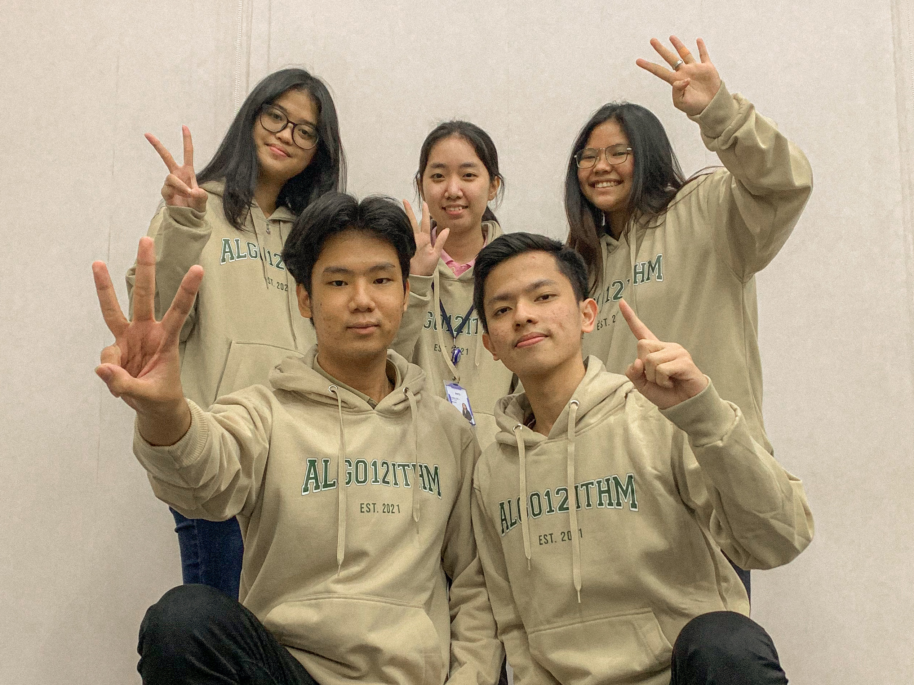

# Eyemorse Computer Vision

This project is created to accomplish <b> Artificial Intelligence </b> Course at my university. This is a group project consisting of:
  

<table>
   <tr>
     <th> Member's Name </th>
     <th> Role </th>
   </tr>
  <tr>
     <td> Jefferson Johan </td>
     <td> Backend Developer </td>
   </tr>
  <tr>
     <td> Vanessa Kwandinata </td>
     <td> Backend Developer </td>
   </tr>
  <tr>
     <td> William Suryadharma </td>
     <td> Frontend Developer </td>
   </tr>
  <tr>
     <td> Charlene Jovannie </td>
     <td> Tester & Adviser </td>
   </tr>
  <tr>
     <td> Natalia Margareth Karundeng </td>
     <td> Tester & Adviser </td>
   </tr>
</table>

Thankyou for <b>Mr. Ivan Halim Parmonangan</b> as our lecturer who always guides gives us instruction during this project. Hope this project can be useful for anyone needs it.

Before you can run the main.py correctly, you should install some packages using pip. Make sure your computer have been installed pip. 
